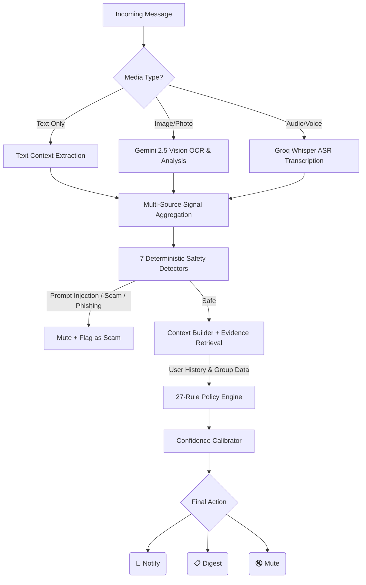

# AI Message Notification Router

<div align="center">


**An enterprise-grade AI system that intelligently routes WhatsApp messages using multimodal analysis, deterministic safety guarantees, and personalized user context.**

[📖 Technical Documentation](TECHNICAL_DOCUMENTATION.md) · [🔌 API Reference](docs/API.md) · [🤝 Contributing](CONTRIBUTING.md) · [📋 Changelog](CHANGELOG.md)

</div>

---

## 🎯 The Problem

Modern messaging platforms deliver every message with the same priority — a bank OTP, a spam forward, and a friend's wedding invite all produce the same buzz. This creates **notification fatigue**, where users either miss critical messages or disable notifications entirely.

## 💡 Our Solution

We built an AI-powered notification intelligence system that analyzes every incoming message across **text**, **images**, and **voice notes** — then makes a smart routing decision:

| Action | When to Use | User Experience |
|--------|-------------|-----------------|
| **`notify`** | Urgent, time-sensitive, personally relevant | 🔔 Phone buzzes immediately |
| **`digest`** | Useful but not urgent | 📋 Batched into a daily summary |
| **`mute`** | Spam, scam, or irrelevant | 🔇 Silently suppressed |

---

## 🏗️ System Architecture



> For a complete deep-dive into every module, see [📖 TECHNICAL_DOCUMENTATION.md](TECHNICAL_DOCUMENTATION.md)

---

## ✨ Key Features

### 🧠 Multimodal AI Processing
- **Image Analysis** — Gemini 2.5 Flash Vision extracts OCR text, visual summaries, QR codes, and financial elements
- **Voice Transcription** — Groq Whisper (`whisper-large-v3-turbo`) transcribes audio with Hinglish transliteration support
- **Text Analysis** — 40+ deterministic features extracted via regex-based signal detection

### 🛡️ Enterprise Safety Pipeline
- **7 Safety Detectors** — Credential risk, payment risk, pressure signals, prompt injection, urgency, link analysis, evidence validation
- **11 Risk Categories** — Tiered from `NONE` (0) to `CREDENTIAL_RISK` (8)
- **Zero Unsafe Notifications** — Scam + Notify combinations are architecturally impossible
- **Prompt Injection Defense** — 17 attack patterns detected with false-positive suppression

### 🌐 Multilingual Support
- **English, Hindi (transliterated), Hinglish** — Full coverage for Indian messaging context
- **OCR Artifact Correction** — `0TP` → `OTP`, `p@ssword` → `password`
- **ASR Variation Handling** — `otpee` → `OTP`, `paasword` → `password`

### 👤 Personalization Engine
- **User Preferences** — Quiet hours, trusted senders, opt-in/opt-out management
- **Behavioral History** — Reply, dismiss, report, and mute patterns
- **Business Context** — Verified business accounts, active transactions, domain trust

### 🏭 Production-Ready
- **118 Deterministic Tests** — No API keys, no network calls, 100% CI reliable
- **Docker Compose** — One-command multi-service deployment
- **GitHub Actions CI/CD** — Automated testing on every push
- **9 Execution Modes** — Automatic failover from live API to deterministic fallback

---

## 🛠️ Tech Stack

| Layer | Technology |
|-------|-----------|
| **AI Pipeline** | Python 3.10, 36 modules, 40+ features |
| **Vision AI** | Google Gemini 2.5 Flash (OCR + Visual Summary) |
| **Speech AI** | Groq Whisper Large v3 Turbo (ASR) |
| **Frontend** | Next.js 15, React, TailwindCSS, Framer Motion |
| **Backend API** | FastAPI (async, auto-documented) |
| **Containerization** | Docker, Docker Compose |
| **CI/CD** | GitHub Actions |
| **Testing** | Pytest (118 deterministic tests) |

---

## 🚀 Quick Start

### Prerequisites
- Python 3.10+
- Node.js 18+ (for frontend)
- Docker & Docker Compose (optional)

### Option 1: Local Development

```bash
# Clone the repository
git clone https://github.com/rohitkumarnaidu/AI-Message-Notification-Router.git
cd AI-Message-Notification-Router

# Install Python dependencies
pip install -r requirements.txt

# Run the AI pipeline
python code/run_phase15.py

# Start the FastAPI backend
uvicorn api:app --reload --port 8000

# Start the Next.js frontend (new terminal)
cd frontend && npm install && npm run dev
```

### Option 2: Docker (One Command)

```bash
docker-compose up --build
# Backend:  http://localhost:8000
# Frontend: http://localhost:3000
# API Docs: http://localhost:8000/docs
```

### Run Tests

```bash
python -m pytest tests/   # 118 tests, ~5 seconds
```

---

## 📊 Output Schema

Every incoming message produces a structured routing decision:

| Column | Description | Allowed Values |
|--------|-------------|----------------|
| `message_id` | Incoming message ID | `MSG_001` ... `MSG_110` |
| `action` | Routing decision | `notify`, `digest`, `mute` |
| `message_type` | Best-fit category | `personal`, `urgent`, `event`, `payment`, `business_update`, `promotion`, `greeting`, `forward`, `spam`, `scam`, `unknown` |
| `reason` | Human-readable explanation | Free text |
| `confidence` | Confidence score | `0.0` — `1.0` |
| `evidence_message_ids` | Historical evidence | Semicolon-separated IDs or `none` |

---

## 📁 Project Structure

```
AI-Message-Notification-Router/
├── code/                    # 36 Python modules (AI pipeline)
│   ├── schemas.py           # 25+ dataclasses & contracts
│   ├── safety_detectors.py  # 7 safety detectors (887 lines)
│   ├── baseline_policy.py   # 27-rule policy engine
│   ├── router.py            # Central orchestrator
│   └── run_phase15.py       # Pipeline entry point
├── dataset/                 # 13 CSV files + media assets
├── tests/                   # 118 deterministic tests
├── frontend/                # Next.js enterprise dashboard
├── api.py                   # FastAPI REST backend
├── Dockerfile               # Backend container
├── docker-compose.yml       # Multi-service orchestration
└── TECHNICAL_DOCUMENTATION.md  # 860+ line design document
```

---

## 📚 Documentation

| Document | Description |
|----------|-------------|
| [📖 Technical Documentation](TECHNICAL_DOCUMENTATION.md) | Complete 19-section design document with 12 Mermaid diagrams |
| [🔌 API Reference](docs/API.md) | REST endpoints, schemas, error handling |
| [🤝 Contributing Guide](CONTRIBUTING.md) | How to contribute, code style, PR process |
| [📋 Changelog](CHANGELOG.md) | Version history and release notes |
| [📜 Problem Statement](problem_statement.md) | Original system specification |
| [⚖️ License](LICENSE) | MIT License |

---

## 🏢 Enterprise Use Cases

| Industry | Application |
|----------|-------------|
| **Banking / Fintech** | Flag OTP phishing, payment scams, impersonation |
| **E-Commerce** | Route order updates vs promotions vs spam |
| **Healthcare** | Triage patient messages by urgency |
| **Enterprise IT** | Internal Slack/Teams notification routing |
| **Social Media** | Reduce group chat notification fatigue |
| **Compliance** | Full audit trail with source provenance |

---

## 📄 License

This project is licensed under the MIT License — see the [LICENSE](LICENSE) file for details.

---

<div align="center">

**Built with ❤️ by [Rohit Kumar Naidu](https://github.com/rohitkumarnaidu)**

An enterprise-grade AI system demonstrating multimodal intelligence, deterministic safety guarantees, and production-ready deployment architecture.

</div>
