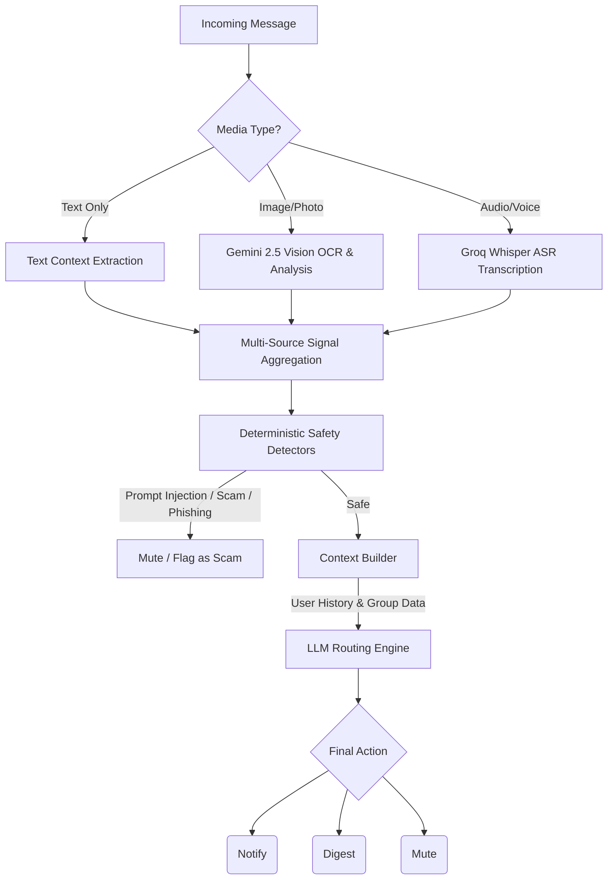

# AI Message Notification Router

An AI-powered, multimodal message notification router that processes text, audio (ASR), and images (OCR) to intelligently route WhatsApp messages while enforcing strict safety and scam-detection guardrails.

## Overview

WhatsApp is noisy. Users receive family chats, society notices, school updates, co-worker messages, business account promotions, image posters, voice notes, and scams in the same message stream. Treating every message the same creates two bad outcomes: important messages get missed, and unwanted or risky messages interrupt the user.

This system takes unstructured multimodal WhatsApp data and categorizes them into actionable routing decisions:
- **Notify**: High-priority, urgent, or important personal messages.
- **Digest**: Low-priority, promotional, or non-urgent updates to read later.
- **Mute**: Spam, scams, or irrelevant chatter.

## System Architecture

## Key Features

- **Multimodal Processing:** Seamlessly handles text, image attachments (extracting OCR and visual summaries), and voice notes.
- **Multilingual Audio Transcription:** Utilizes Groq Whisper (`whisper-large-v3-turbo`) to transcribe audio, including handling Hinglish transliterations (e.g., `otpee` to `OTP`).
- **Deterministic Safety Guardrails:** Hardcoded rule-engines intercept prompt injections, phishing URLs, and credential/payment fraud before LLM evaluation, ensuring zero unsafe notifications.
- **Context-Aware Reasoning:** Leverages historical message data, user notification behavior, and group metadata to make highly personalized routing decisions.
- **Resumable Caching:** Media extractions are hashed and cached on disk to minimize API latency and bypass rate-limiting.

## Tech Stack

- **Frontend:** Next.js (App Router), React, TailwindCSS, Framer Motion
- **Backend:** FastAPI, Python 3.10
- **AI Models:** Gemini 2.5 Flash Vision, Groq Whisper (whisper-large-v3-turbo)
- **Deployment:** Docker, Docker Compose, GitHub Actions CI/CD

## Output Schema

For each processed message, the system produces a structured output:

| Column | Description |
|---|---|
| `message_id` | Incoming message ID |
| `action` | Routing decision (`notify`, `digest`, or `mute`) |
| `message_type` | Best-fit message category (e.g., `personal`, `urgent`, `spam`) |
| `reason` | Short human-readable explanation of the routing decision |
| `confidence` | Confidence score from `0.0` to `1.0` |
| `evidence_message_ids` | Historical message IDs used as evidence for personalization |
