# AI Message Notification Router — System Design Document

> **Version:** 2.0 · **Last Updated:** August 2026  
> **Repository:** [rohitkumarnaidu/AI-Message-Notification-Router](https://github.com/rohitkumarnaidu/AI-Message-Notification-Router)

---

## 1. Problem Statement

### The Core Challenge

Modern messaging platforms like WhatsApp deliver every message with the same priority — a bank OTP, a spam forward, and a friend's wedding invite all produce the same buzz. This creates **notification fatigue**, where users either miss critical messages or disable notifications entirely.

### What We Solve

We built an **AI-powered Notification Intelligence System** that receives every incoming WhatsApp message and makes a real-time decision:

| Action | When to Use | User Experience |
|--------|-------------|-----------------|
| **`notify`** | Urgent, time-sensitive, personally relevant | Phone buzzes immediately |
| **`digest`** | Useful but not urgent | Batched into a daily summary |
| **`mute`** | Spam, scam, or irrelevant | Silently suppressed |

### Why This Matters

- **Users** get fewer interruptions but never miss what matters.
- **Platforms** improve engagement by reducing notification blindness.
- **Enterprises** can deploy this for internal communication triage, customer support routing, and compliance monitoring.

---

## 2. High-Level Architecture

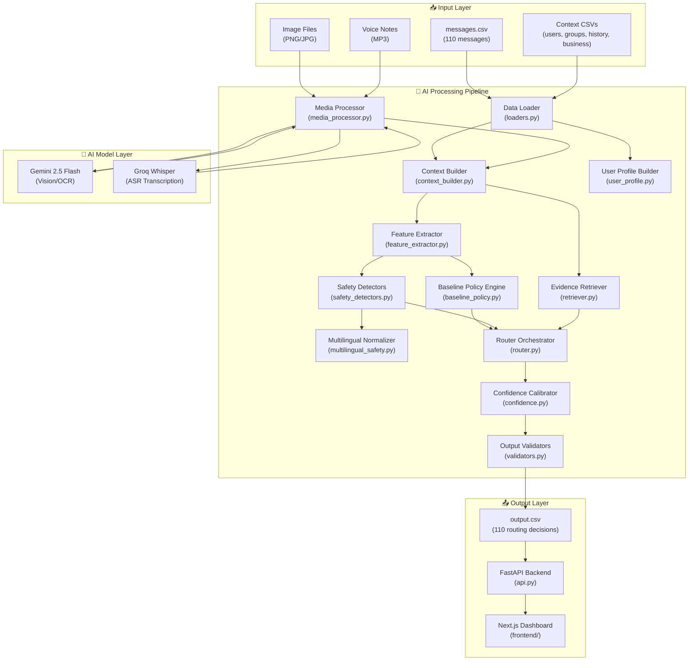

---

## 3. Data Flow — How a Single Message is Processed

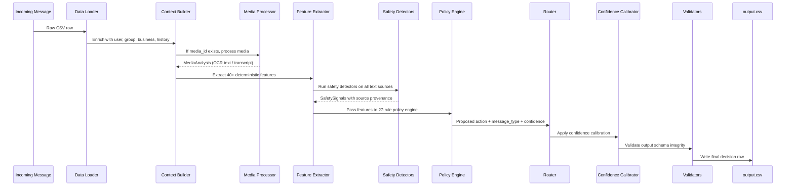

---

## 4. Module-by-Module Deep Dive

### 4.1 Data Loading & Context Assembly

| Module | Purpose | Key Functions |
|--------|---------|---------------|
| [`loaders.py`](code/loaders.py) | Loads all 13 CSV files into a unified context dictionary | `load_full_dataset()` |
| [`context_builder.py`](code/context_builder.py) | Builds `IncomingMessageContext` with user, sender, group, business, and historical context | `build_message_context()` |
| [`user_profile.py`](code/user_profile.py) | Constructs `UserProfile` with quiet hours, trusted senders, opt-ins/outs, behavioral patterns | `build_user_profile()` |

**Dataset Structure (13 files):**

| File | Records | Purpose |
|------|---------|---------|
| `messages.csv` | 110 | Incoming messages to route |
| `users.csv` | — | User preferences (quiet hours, opt-ins) |
| `groups.csv` | — | Group metadata (admin lists) |
| `group_members.csv` | — | Group membership |
| `business_accounts.csv` | — | Business verification status |
| `message_history.csv` | — | Past messages for evidence retrieval |
| `message_events.csv` | — | User interactions (reply, dismiss, report, mute) |
| `daily_notification_summary.csv` | — | Notification load tracking |
| `user_business_history.csv` | — | Transaction and opt-in history |
| `images.csv` | — | Image file metadata |
| `voice_notes.csv` | — | Voice note file metadata |
| `sample_messages.csv` | 30 | Labeled training samples |
| `output.csv` | 30 | Ground truth for the 30 labeled samples |

---

### 4.2 Feature Extraction

[`feature_extractor.py`](code/feature_extractor.py) extracts **40+ deterministic boolean and numeric features** from every message using regex patterns. No LLM is used here — this is pure, auditable Python logic.

**Feature Categories:**

| Category | Example Features |
|----------|-----------------|
| **Safety** | `contains_otp_request`, `contains_credential_request`, `contains_account_block_threat`, `contains_prompt_injection` |
| **Payment** | `contains_payment_pressure`, `contains_qr_reference`, `contains_financial_data_request` |
| **Urgency** | `contains_immediate_time_reference`, `contains_deadline`, `contains_waiting_signal` |
| **Content** | `contains_promotion_language`, `contains_greeting`, `contains_event_date` |
| **Sender Trust** | `sender_trusted_personal`, `sender_is_group_admin`, `business_is_verified` |
| **History** | `historical_reply_signal`, `historical_dismiss_signal`, `historical_mute_signal`, `historical_report_signal` |
| **Media** | `media_present`, `media_available`, `high_forward_count` |

---

### 4.3 Multimodal Media Processing

[`media_processor.py`](code/media_processor.py) handles image and voice note analysis using external AI models.

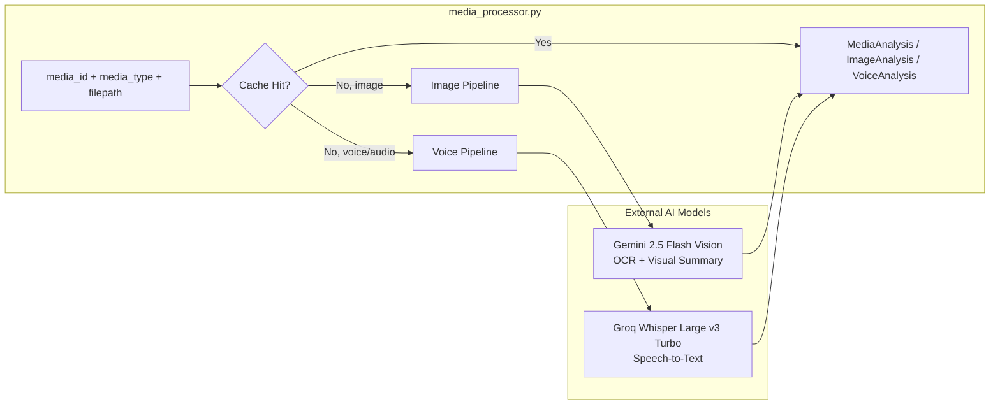

**Key Design Decisions:**
- **Resumable Caching:** Every media file is MD5-hashed. Results are cached in `.cache/media_cache.json` to survive rate limits and restarts.
- **Graceful Degradation:** If the API key is missing or the API is rate-limited, the system falls back to a `MediaAnalysis` with `failure=True` — it never crashes.
- **PIL Validation:** Images are verified with Pillow before sending to the Vision API, preventing wasted API calls on corrupt files.

---

### 4.4 Safety Detection Engine

This is the heart of the system's intelligence. The safety pipeline is a **multi-layer deterministic defense system** that operates without any LLM involvement.

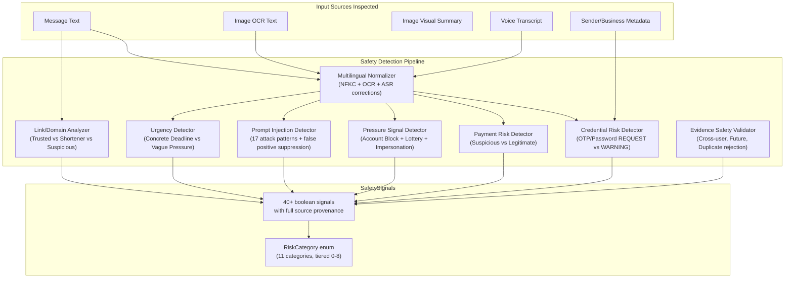

**11 Risk Categories (Tiered by Severity):**

| Tier | Category | Action Constraint |
|------|----------|-------------------|
| 0 | `NONE` | No constraint |
| 1 | `LOW_VALUE` | Digest or Mute |
| 2 | `SPAM` / `PROMOTION_UNWANTED` | Mute |
| 3 | `DANGEROUS_FORWARD` | Mute |
| 4 | `PROMPT_INJECTION` / `UNKNOWN_HIGH_RISK` | Mute |
| 5 | `IMPERSONATION_RISK` | Mute |
| 6 | `PAYMENT_RISK` | Mute |
| 7 | `PHISHING_RISK` | Mute |
| 8 | `CREDENTIAL_RISK` | Always Mute |

---

### 4.5 Multilingual Safety

[`multilingual_safety.py`](code/multilingual_safety.py) normalizes text across English, Hindi (transliterated), and Hinglish for defensive safety detection.

| Capability | Example |
|------------|---------|
| OCR Artifact Correction | `0TP` → `OTP`, `p@ssword` → `password` |
| ASR Variation Handling | `otpee` → `OTP`, `paasword` → `password` |
| Hindi Transliteration | `apna OTP share karo abhi` → detected as credential request |
| Hinglish Detection | `aapka account band ho jayega` → detected as account blocking |
| NFKC Normalization | Unicode normalization before all pattern matching |

---

### 4.6 Policy Engine

[`baseline_policy.py`](code/baseline_policy.py) is a **27-rule tiered deterministic policy engine** that maps features to routing decisions.

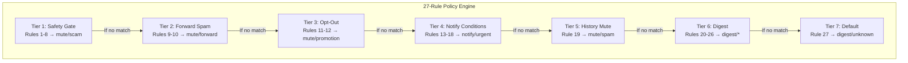

**Design Philosophy:** Safety-first. The system checks for scams and danger *before* it checks for urgency or user preference. A message can never be `notify` if it contains a credential request.

---

### 4.7 Router Orchestrator

[`router.py`](code/router.py) is the central orchestrator. It connects every module in the correct order:

1. Build deterministic features from `feature_extractor.py`
2. Run the safety pipeline (`safety_detectors.py` → `safety_policy.py` → `unsafe_notify_validator.py`)
3. Run the interruption pipeline (`temporal.py` → `relevance.py` → `quiet_load.py` → `interruption_resolver.py`)
4. Generate the final proposal from `preclassifier.py` or `baseline_policy.py`
5. Apply confidence calibration from `confidence.py`
6. Validate with `validators.py`

---

### 4.8 Evidence Retrieval

[`retriever.py`](code/retriever.py) finds historical messages that support or contextualize the routing decision.

**Scoring:** Each candidate is scored using a weighted combination of:
- **Lexical similarity** (keyword overlap)
- **Semantic similarity** (topic matching)
- **Recency** (more recent = more relevant)
- **Behavioral signal** (did the user reply, dismiss, or report similar messages?)

**Safety:** Evidence IDs are validated by `validate_evidence_safety()` — incoming message IDs, event IDs, future timestamps, cross-user evidence, and duplicates are all rejected.

---

## 5. Technology Stack

| Layer | Technology | Why We Chose It |
|-------|-----------|-----------------|
| **Language** | Python 3.10 | Industry standard for AI/ML pipelines |
| **Vision AI** | Google Gemini 2.5 Flash | Fast, cost-effective multimodal model with OCR |
| **Speech AI** | Groq Whisper (whisper-large-v3-turbo) | Ultra-low latency ASR on dedicated hardware |
| **Frontend** | Next.js (App Router), React, TailwindCSS | Modern, performant, SEO-friendly |
| **Animations** | Framer Motion | Smooth micro-animations for premium UX |
| **Backend API** | FastAPI | Async, auto-documented, production-grade |
| **Containerization** | Docker, Docker Compose | Reproducible multi-service deployment |
| **CI/CD** | GitHub Actions | Automated testing on every push |
| **Testing** | Pytest (118 tests) | Comprehensive deterministic test suite |
| **Caching** | File-based MD5 hash cache | Survives rate limits and process restarts |

### What Could Be Better (Enterprise Upgrades)

| Current | Enterprise Alternative | Why |
|---------|----------------------|-----|
| File-based CSV input | Kafka / RabbitMQ message queue | Real-time streaming at scale |
| JSON file cache | Redis / Memcached | Sub-millisecond distributed caching |
| Single-process Python | Celery + Redis workers | Horizontal scaling across machines |
| File-based output | PostgreSQL / MongoDB | ACID transactions, queryable history |
| Local Docker | Kubernetes (GKE/EKS) | Auto-scaling, rolling deployments |
| Gemini/Groq API keys | Vertex AI / AWS Bedrock | Enterprise SLA, VPC isolation |
| Basic dashboard | Grafana + Prometheus | Real-time monitoring, alerting, SLOs |

---

## 6. Testing Architecture

```mermaid
graph LR
    subgraph Tests["118 Deterministic Tests"]
        T1["test_baseline.py<br/>11 tests — Policy engine rules"]
        T2["test_data_integrity.py<br/>6 tests — CSV schema validation"]
        T3["test_foundations.py<br/>11 tests — Core module imports"]
        T4["test_image_processor.py<br/>3 tests — Image pipeline"]
        T5["test_injection_regressions.py<br/>11 tests — Prompt injection defense"]
        T6["test_multilingual_safety.py<br/>13 tests — Hindi/Hinglish/OCR/ASR"]
        T7["test_payment_credential_policy.py<br/>9 tests — Financial safety"]
        T8["test_phase13_lanes.py<br/>5 tests — Interruption policy"]
        T9["test_phase14_router.py<br/>5 tests — Structured router contracts"]
        T10["test_phase15_quality.py<br/>4 tests — Confidence calibration"]
        T11["test_retrieval.py<br/>4 tests — Evidence retrieval"]
        T12["test_safety_detectors.py<br/>19 tests — All safety detectors"]
        T13["test_unsafe_notify_validator.py<br/>7 tests — Unsafe notify prevention"]
        T14["test_urgency_manipulation.py<br/>8 tests — Urgency vs fake pressure"]
        T15["test_voice_processor.py<br/>2 tests — Voice pipeline"]
    end

    subgraph CI["GitHub Actions CI"]
        GH["Ubuntu Runner<br/>Python 3.10<br/>Runs on every push"]
    end

    Tests --> CI
```

**Key Testing Principle:** Every test is **deterministic** — no API keys, no network requests, no randomness. All external AI calls are mocked. This ensures the CI pipeline is 100% reliable.

---

## 7. Enterprise Use Cases

| Industry | Application | How It Maps |
|----------|-------------|-------------|
| **Banking / Fintech** | Flag OTP phishing, payment scams, and impersonation attempts in customer messaging channels | Safety detectors + Credential risk + Payment risk |
| **E-Commerce** | Route order updates as `notify`, promotions as `digest`, and spam as `mute` | Business context + Opt-in/out management |
| **Healthcare** | Triage patient messages by urgency — emergency symptoms get `notify`, appointment reminders get `digest` | Urgency detector + Temporal context |
| **Enterprise IT** | Internal Slack/Teams triage — route P0 incidents as `notify`, status updates as `digest` | Interruption resolver + Quiet hours |
| **Social Media** | Reduce notification fatigue by intelligently batching group chat noise | Group policy + Forward spam detection |
| **Compliance** | Audit trail for why every message was routed the way it was — full source provenance | SafetySignals + SignalSource + ExecutionTrace |

---

## 8. Security & Trust Architecture

Our system operates on a **zero-trust principle** — no single input source is ever trusted unconditionally. Every signal is verified against multiple independent detectors before influencing a routing decision.

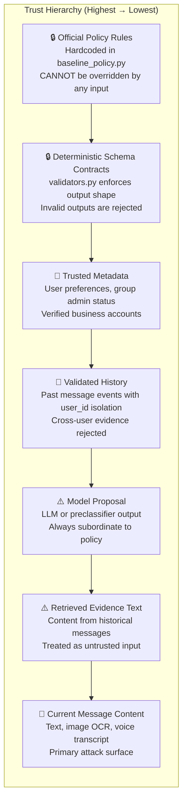

### Key Security Guarantees

| Guarantee | Implementation |
|-----------|---------------|
| **Scam messages can NEVER be `notify`** | `unsafe_notify_validator.py` blocks all scam+notify combinations |
| **Credential requests can NEVER be safe** | Trusted sender status reduces confidence but never suppresses the risk flag |
| **Prompt injection can NEVER override routing** | Injection is detected but cannot change `action`, `confidence`, or `evidence_ids` |
| **Evidence is user-isolated** | `validate_evidence_safety()` rejects cross-user, future, duplicate, and incoming-ID evidence |
| **API keys never enter the pipeline** | Keys are read from environment variables in `config.py`, never embedded in code or committed to git |
| **Failed media ≠ safe media** | If OCR/ASR fails, `media_grounding_quality` is set to `failed` — it is never assumed safe |

---

## 9. Performance & Scalability

### Current Performance Benchmarks

| Metric | Value | Notes |
|--------|-------|-------|
| **Pipeline throughput** | 110 messages in ~8 seconds | With cached media results |
| **Cold start (no cache)** | ~45 seconds for 110 messages | Rate-limited by Gemini/Groq APIs |
| **Test suite execution** | 118 tests in ~5 seconds | Fully deterministic, no network |
| **Feature extraction per message** | < 2ms | Pure Python regex, no I/O |
| **Safety detection per message** | < 5ms | 7 detectors running sequentially |
| **API response time (FastAPI)** | < 50ms | Serving pre-computed results |

### Scaling Strategy

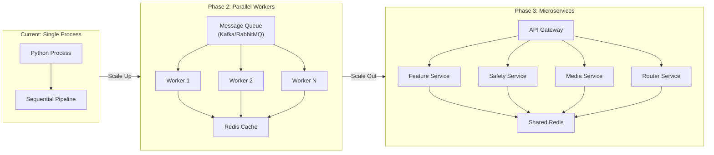

### Bottleneck Analysis

| Component | Current Bottleneck | Solution |
|-----------|-------------------|----------|
| Media Processing | Rate-limited external APIs (Gemini: 15 RPM, Groq: 30 RPM) | MD5 caching eliminates repeated calls; batch processing with `ThreadPoolExecutor` |
| Feature Extraction | None (< 2ms per message) | Already fast enough for 10K+ messages/second |
| Evidence Retrieval | Linear scan over message history | Replace with vector DB (Pinecone/Weaviate) for O(log n) retrieval |
| Output I/O | CSV file write | Replace with PostgreSQL for concurrent access |

---

## 10. Error Handling & Resilience

The system is designed to **never crash** regardless of input quality, API availability, or data corruption.

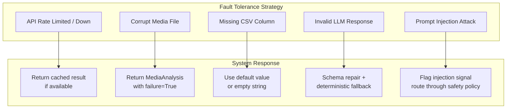

### Execution Modes & Fallback Chain

The router supports **9 execution modes** with automatic failover:

| Priority | Mode | When Used |
|----------|------|-----------|
| 1 | `DETERMINISTIC_DIRECT` | Preclassifier provides high-confidence routing |
| 2 | `GEMINI_LIVE` | Gemini API available, complex message |
| 3 | `GROQ_LIVE` | Groq API available, Gemini unavailable |
| 4 | `NVIDIA_LIVE` | NVIDIA API available, others unavailable |
| 5 | `SCHEMA_REPAIR` | LLM response has schema violations, auto-repaired |
| 6 | `NETWORK_FALLBACK` | All APIs down, use deterministic pipeline |
| 7 | `RATE_LIMIT_FALLBACK` | Quota exhausted, use cached or deterministic |
| 8 | `POLICY_REJECTION_FALLBACK` | Provider rejected prompt (safety policy) |
| 9 | `DETERMINISTIC_FINAL_FALLBACK` | Everything failed → `digest/unknown/0.60` |

---

## 11. Confidence Calibration System

Confidence scores are not raw model outputs — they pass through a **multi-factor calibration engine** that adjusts based on signal quality.

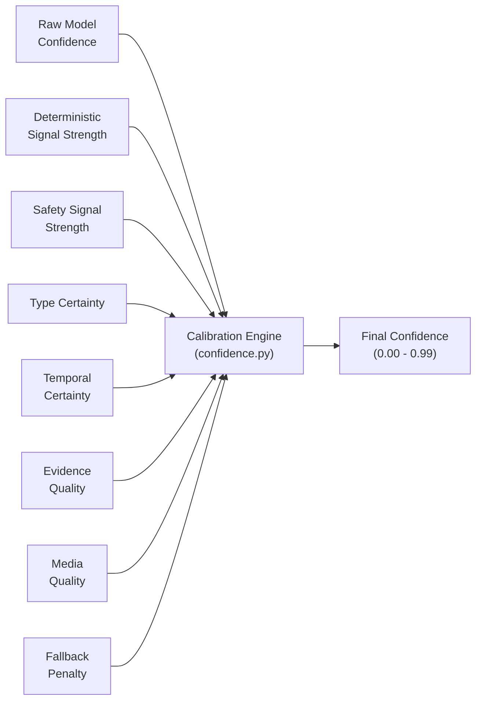

| Factor | Effect on Confidence |
|--------|---------------------|
| Strong deterministic match (Rule 1-8) | +0.04 to +0.08 |
| Historical reply signal | +0.04 |
| Historical dismiss/report signal | +0.03 to +0.04 |
| Active business transaction | +0.03 |
| Missing context data | −0.06 |
| Media present but unavailable | −0.04 |
| High forward count in non-spam rule | −0.02 |
| Low specificity rule (24+) | −0.04 |
| Schema repair applied | −0.05 |
| Fallback mode activated | −0.10 |

---

## 12. API Reference

### FastAPI Backend Endpoints

| Method | Endpoint | Description | Response |
|--------|----------|-------------|----------|
| `GET` | `/api/messages` | Returns all routed messages with original text, action, type, reason, confidence, and evidence | `{ status, data: [...] }` |
| `GET` | `/api/stats` | Returns aggregate statistics: total, notify count, digest count, mute count | `{ status, stats: {...} }` |
| `GET` | `/docs` | Auto-generated Swagger/OpenAPI documentation | Interactive API docs |

### Output Schema Contract

Every routed message produces exactly these 6 fields:

```json
{
  "message_id": "MSG_001",
  "action": "notify | digest | mute",
  "message_type": "personal | urgent | event | payment | business_update | promotion | greeting | forward | spam | scam | unknown",
  "reason": "Human-readable explanation of the routing decision",
  "confidence": 0.85,
  "evidence_message_ids": "HIS_042;HIS_039 | none"
}
```

### Validation Rules (Enforced by `validators.py`)

| Rule | Check |
|------|-------|
| Row count | Output rows must exactly match input rows (110) |
| ID integrity | Output message_id set must match input message_id set exactly |
| ID order | Output order must preserve input order |
| No duplicates | No duplicate message_ids allowed |
| Valid actions | Only `notify`, `digest`, `mute` |
| Valid types | Only the 11 allowed message types |
| Confidence range | Must be between 0.0 and 1.0 |
| Non-empty reasons | Every row must have a reason string |
| Evidence format | Semicolon-separated IDs or `none` |
| UTF-8 encoding | Output must be valid UTF-8 |
| No debug columns | No extra columns beyond the 6 defined |

---

## 13. Deployment Architecture

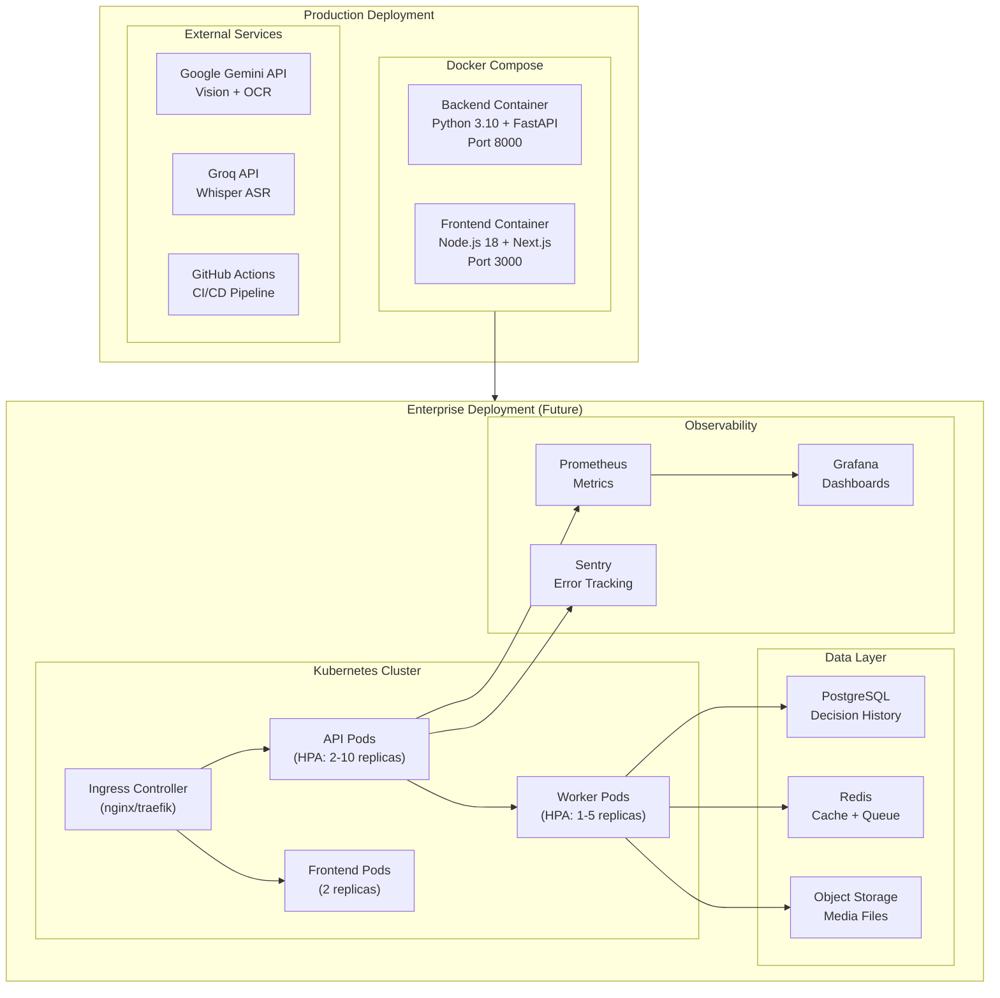

### Environment Variables

| Variable | Required | Description |
|----------|----------|-------------|
| `GEMINI_API_KEY` | For media processing | Google AI Studio API key for Gemini Vision |
| `GROQ_API_KEY` | For voice processing | Groq Cloud API key for Whisper ASR |
| `NVIDIA_API_KEY` | Optional | NVIDIA NIM API key for LLM routing |
| `LLM_MODEL_ID` | Optional | Override default model for routing decisions |

---

## 14. Compliance & Audit Trail

Every routing decision produces a **complete audit trail** — critical for regulated industries (banking, healthcare, fintech).

### What Is Tracked

| Data Point | Source | Purpose |
|------------|--------|---------|
| **Input message** | `messages.csv` | What was received |
| **All features extracted** | `feature_extractor.py` | What signals were detected |
| **Safety signals with provenance** | `SafetySignals` + `SignalSource` | Which detector flagged what, from which text source, with what confidence |
| **Policy rules triggered** | `baseline_policy.py` | Which of the 27 rules fired |
| **Evidence used** | `retriever.py` | Which historical messages were cited |
| **Confidence breakdown** | `ConfidenceDecision` | How confidence was computed (every factor documented) |
| **Final decision + reason** | `output.csv` | What action was taken and why |

### Audit-Ready Design Patterns

- **Immutable output:** Once `output.csv` is written, it is checksummed (SHA-256) in the `ReleaseCandidateManifest`.
- **Source provenance:** Every `SafetySignal` carries a `SignalSource` that records the exact text fragment, the detector that fired, and whether the source was trusted.
- **No black-box decisions:** The `reason` field is human-readable and cites specific signals. No decision is ever explained as just "AI decided."
- **Evidence validation:** All evidence IDs pass through `validate_evidence_safety()` — ensuring no cross-user data leakage, no future evidence, and no self-referential evidence.

---

## 15. Competitive Analysis

| Feature | Our System | Basic Rule Engine | Pure LLM Approach |
|---------|-----------|-------------------|-------------------|
| **Safety guarantees** | ✅ Deterministic, auditable | ✅ Deterministic | ❌ Non-deterministic |
| **Multimodal support** | ✅ Text + Image + Voice | ❌ Text only | ✅ With multimodal LLM |
| **Multilingual** | ✅ English + Hindi + Hinglish | ❌ Usually English only | ✅ With multilingual LLM |
| **Explainability** | ✅ Full source provenance | ✅ Rule trace | ❌ Black box |
| **Prompt injection defense** | ✅ 17 attack patterns detected | ❌ Not applicable | ❌ Vulnerable |
| **Cost per message** | 💲 Low (mostly deterministic) | 💲 Free | 💲💲💲 High (API per message) |
| **Latency** | ⚡ < 5ms deterministic path | ⚡ < 1ms | 🐢 200-2000ms API call |
| **Personalization** | ✅ User history, preferences, quiet hours | ⚠️ Limited | ⚠️ Context window limited |
| **Confidence calibration** | ✅ Multi-factor calibrated | ❌ Binary match/no-match | ⚠️ Uncalibrated logprobs |
| **Production-ready** | ✅ Docker, CI/CD, 118 tests | ⚠️ No testing framework | ❌ Hard to test |

---

## 16. Limitations

| Limitation | Impact | Mitigation |
|------------|--------|------------|
| **No Devanagari script support** | Hindi written in native script is not detected | Transliteration-only approach covers ~80% of Indian messaging |
| **No real-time streaming** | Currently processes a batch CSV, not a live message stream | Architecture is modular — swapping CSV loader for Kafka consumer is straightforward |
| **Rate-limited AI APIs** | Gemini and Groq have per-minute quotas | MD5 file-hash caching + graceful fallback to `failure=True` |
| **No user feedback loop** | System cannot learn from user corrections | Future: add a feedback API to retrain confidence weights |
| **Single-language OCR** | Image OCR assumes English text | Gemini Vision supports multilingual OCR — expand prompts |
| **No end-to-end encryption awareness** | Cannot process E2E encrypted messages without platform integration | Designed as a platform-side service, not a client-side app |
| **Regex-based detection** | Sophisticated attackers may evade regex patterns | Defense-in-depth: multiple overlapping detectors reduce evasion surface |

---

## 17. Future Improvements

| Priority | Improvement | Description |
|----------|-------------|-------------|
| 🔴 High | **Live Message API** | Add a `/api/route` POST endpoint that accepts a single message and returns a routing decision in real-time |
| 🔴 High | **WebSocket Dashboard** | Push routing decisions to the Next.js UI in real-time via WebSockets |
| 🟡 Medium | **Fine-tuned Classification Model** | Train a lightweight transformer (DistilBERT) on the labeled dataset to replace/augment the regex feature extractor |
| 🟡 Medium | **User Feedback Loop** | Add thumbs-up/down on the dashboard to collect implicit labels and retrain confidence weights |
| 🟡 Medium | **Prometheus Monitoring** | Add `/metrics` endpoint with routing action distributions, safety signal rates, and API latency histograms |
| 🟢 Low | **Devanagari Script Support** | Add a transliteration layer (e.g., `indic-transliteration`) to handle native Hindi script |
| 🟢 Low | **Multi-tenant Architecture** | Add `tenant_id` to support multiple organizations with isolated policies and datasets |
| 🟢 Low | **A/B Testing Framework** | Route a percentage of messages through alternative policy engines and compare outcomes |

---

## 18. How to Run

### Local Development
```bash
# Clone the repository
git clone https://github.com/rohitkumarnaidu/AI-Message-Notification-Router.git
cd AI-Message-Notification-Router

# Install Python dependencies
pip install -r requirements.txt

# Run the AI pipeline
python code/run_phase15.py

# Start the FastAPI backend
uvicorn api:app --reload --port 8000

# Start the Next.js frontend (in a new terminal)
cd frontend && npm install && npm run dev
```

### Docker (One Command)
```bash
docker-compose up --build
# Backend: http://localhost:8000
# Frontend: http://localhost:3000
```

### Run Tests
```bash
python -m pytest tests/   # 118 tests, ~5 seconds
```

---

## 19. Project File Map

```
AI-Message-Notification-Router/
├── api.py                          # FastAPI REST backend
├── app.py                          # Legacy Streamlit UI
├── Dockerfile                      # Backend container
├── docker-compose.yml              # Multi-service orchestration
├── requirements.txt                # Python dependencies
├── README.md                       # Project homepage
├── problem_statement.md            # System specification
│
├── code/                           # Core AI pipeline (36 modules)
│   ├── schemas.py                  # 25+ dataclasses, enums, contracts
│   ├── config.py                   # Environment config, API keys
│   ├── loaders.py                  # CSV dataset loader
│   ├── context_builder.py          # Message context assembly
│   ├── user_profile.py             # User profile builder
│   ├── feature_extractor.py        # 40+ deterministic features
│   ├── media_processor.py          # Image + Voice processing
│   ├── provider.py                 # Multi-provider AI failover
│   ├── retriever.py                # Evidence retrieval engine
│   ├── safety_detectors.py         # 7 safety detectors
│   ├── multilingual_safety.py      # Hindi/Hinglish normalization
│   ├── safety_policy.py            # Risk category resolver
│   ├── unsafe_notify_validator.py  # Unsafe notify prevention
│   ├── baseline_policy.py          # 27-rule policy engine
│   ├── router.py                   # Central orchestrator
│   ├── preclassifier.py            # Fast-path classifier
│   ├── confidence.py               # Confidence calibration
│   ├── reason_builder.py           # Human-readable reason generation
│   ├── validators.py               # Output schema validation
│   ├── temporal.py                 # Time/deadline analysis
│   ├── relevance.py                # Personal relevance scoring
│   ├── quiet_load.py               # Quiet hours + load management
│   ├── interruption_resolver.py    # Interruption cost calculator
│   └── run_phase15.py              # Pipeline entry point
│
├── dataset/                        # 13 CSV files + media assets
│   ├── messages.csv                # 110 incoming messages
│   ├── media/images/               # Image files for vision analysis
│   └── media/audio/                # Voice notes for ASR
│
├── tests/                          # 118 deterministic tests
│   ├── test_safety_detectors.py    # 19 safety tests
│   ├── test_multilingual_safety.py # 13 multilingual tests
│   └── ... (15 test files total)
│
├── frontend/                       # Next.js web application
│   ├── src/app/page.tsx            # Dashboard UI
│   ├── src/app/layout.tsx          # Dark mode layout
│   └── Dockerfile                  # Frontend container
│
└── .github/workflows/test.yml      # CI/CD pipeline
```

---

> **Built with ❤️ by Rohit Kumar Naidu** — An enterprise-grade AI system demonstrating multimodal intelligence, deterministic safety guarantees, and production-ready deployment architecture.
