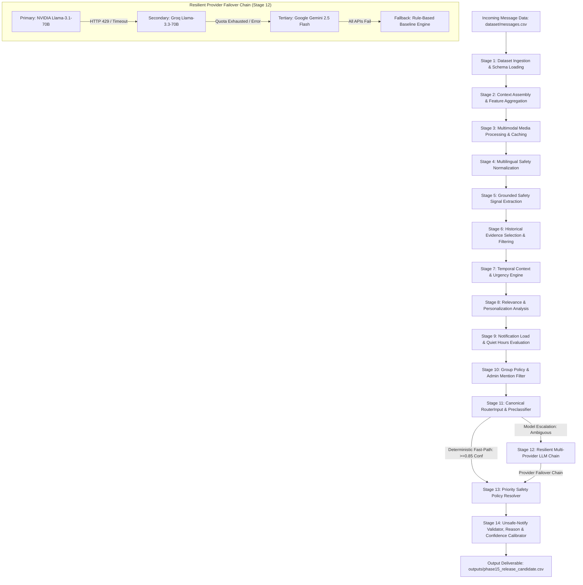
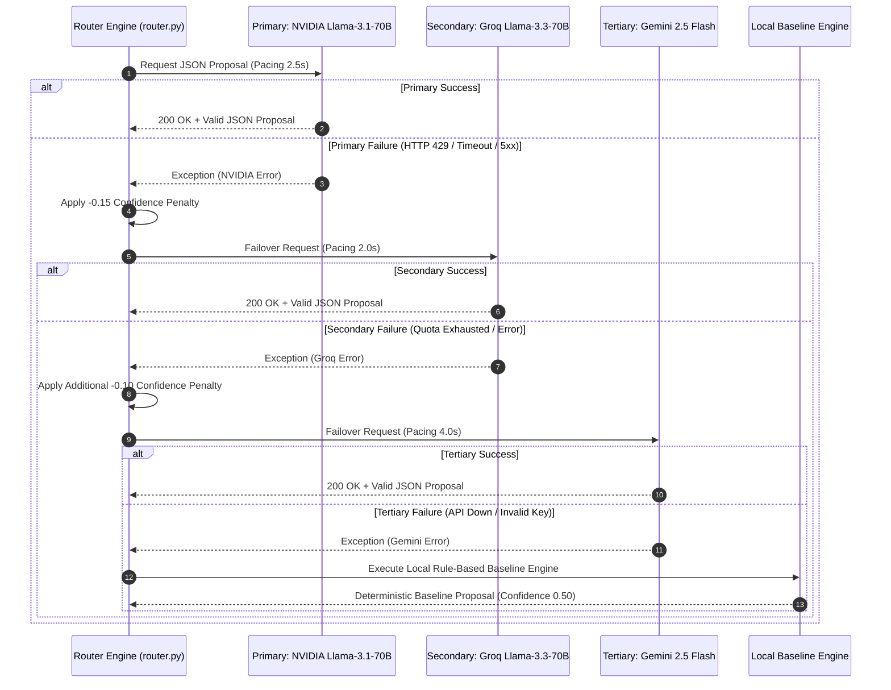

# AI Judge Architecture & End-to-End System Design

## Executive Overview

The **HackerRank Orchestrate Message Notification Router** is an enterprise-grade, high-reliability AI system designed for selective notification routing of WhatsApp message streams. Messaging data includes direct messages, group chats, promotional broadcasts, media files (images and voice notes), and security threats (scams, credential harvesting, prompt injection).

To maximize precision, eliminate security leaks, minimize latency, and lower token costs, our architecture employs a **14-Stage Selective Hybrid Design**. Simple, high-certainty messages bypass Large Language Models (LLMs) entirely via deterministic fast-path preclassifiers (<1ms latency, 0 API cost). Complex, ambiguous messages escalate to a resilient multi-provider failover chain (NVIDIA Llama-3.1-70B -> Groq Llama-3.3-70B -> Gemini 2.5 Flash). All decision proposals pass through a deterministic 10-level priority safety policy resolver and unsafe-notify validator before output generation.

---

## Complete End-to-End 14-Stage Text Flow Diagram

---

## Component-by-Component Architectural Breakdown

### 1. Dataset Ingestion & Schema Loading
* **Source Module**: [code/loaders.py](file:///c:/Hackathons/Hackerrank/Message%20Notification%20Router/hackerrank-orchestrate-august26/code/loaders.py#L1-L75)
* **Inputs**: Path to `dataset/` CSV files (`messages.csv`, `users.csv`, `groups.csv`, `group_members.csv`, `business_accounts.csv`, `user_business_history.csv`, `message_history.csv`, `message_events.csv`, `images.csv`, `voice_notes.csv`).
* **Logic**: Loads CSV files into pandas DataFrames, validates required headers, coerces data types, replaces NaN/null values with default empty structures, and builds in-memory dictionary lookup indexes for O(1) retrieval.
* **Output**: `DatasetBundle` object containing structured DataFrames and lookup maps.
* **Failure Mode & Recovery**: If a required dataset CSV is missing, falls back to empty default schemas; if optional fields are missing, fills defaults without crashing.
* **Rationale**: Ensures fast, error-free data access and protects all downstream modules from `KeyError` or `NullPointerException` crashes.

---

### 2. Context Assembly & Feature Aggregation
* **Source Module**: [code/context_builder.py](file:///c:/Hackathons/Hackerrank/Message%20Notification%20Router/hackerrank-orchestrate-august26/code/context_builder.py#L1-L110), [code/feature_extractor.py](file:///c:/Hackathons/Hackerrank/Message%20Notification%20Router/hackerrank-orchestrate-august26/code/feature_extractor.py#L1-L250)
* **Inputs**: Target `message_id` and `DatasetBundle`.
* **Logic**: Joins raw message attributes with receiving user profile settings (`quiet_hours_start`, `quiet_hours_end`, `daily_notifications`), group metadata (`is_muted`), sender relationship context (`is_trusted`, `is_known`), business interaction history (`opt_in`, `opt_out`), and past action event ratios (`reply_ratio`, `mute_ratio`, `report_ratio`).
* **Output**: Immutable `IncomingMessageContext` dataclass containing complete 360-degree user-message context.
* **Failure Mode & Recovery**: Missing user profile attributes default to neutral non-quiet, low-load preferences.
* **Rationale**: Personalization requires viewing content through the lens of the receiving user rather than evaluating text in isolation.

---

### 3. Multimodal Media Processing & Caching
* **Source Module**: [code/media_processor.py](file:///c:/Hackathons/Hackerrank/Message%20Notification%20Router/hackerrank-orchestrate-august26/code/media_processor.py#L1-L280)
* **Inputs**: `image_id` or `voice_note_id` referenced in message, local image/audio file paths.
* **Logic**:
  * **Image Processing**: Verifies image byte integrity with PIL, calculates MD5 hash, checks disk cache `.cache/media_cache.json`. On cache miss, calls Gemini 2.5 Flash Vision API to extract OCR text, visual summary, QR presence, financial element markers, and visual prompt injection signals.
  * **Audio Processing**: Verifies audio byte integrity, calculates MD5 hash, checks disk cache. On cache miss, calls Groq Whisper ASR (`whisper-large-v3-turbo`) to transcribe speech, extracting urgency markers and financial/credential keywords.
* **Output**: `ImageAnalysis` or `VoiceAnalysis` dataclasses.
* **Failure Mode & Recovery**: If media file is corrupt or missing, sets `failure=True`, applies a -0.15 confidence penalty downstream, and prevents `notify` routing for unverified media.
* **Rationale**: Media payloads are common vectors for spam, scams, and prompt injections; caching prevents duplicate latency and API costs.

---

### 4. Multilingual Safety Normalization & Transliteration
* **Source Module**: [code/multilingual_safety.py](file:///c:/Hackathons/Hackerrank/Message%20Notification%20Router/hackerrank-orchestrate-august26/code/multilingual_safety.py#L1-L240)
* **Inputs**: Raw message text, image OCR text, voice transcript text.
* **Logic**: Applies Unicode NFKC normalization, fixes OCR character/digit substitutions (`0TP` -> `OTP`, `p@ssw0rd` -> `password`), corrects ASR phonetic mishearings (`oh tee pee` -> `OTP`), and normalizes Latin-script Hindi/Hinglish phrasing (`turant pay karo`, `khata band ho jayega`, `inaam jeeta`).
* **Output**: `NormalizationResult` containing `normalized_text` for safety detectors while preserving `original_text` for reason generation.
* **Failure Mode & Recovery**: Falls back to original text if normalization produces empty strings.
* **Rationale**: Adversaries use obfuscation and Hinglish transliteration to bypass standard English regex filters.

---

### 5. Grounded Safety Signal Extraction
* **Source Module**: [code/safety_detectors.py](file:///c:/Hackathons/Hackerrank/Message%20Notification%20Router/hackerrank-orchestrate-august26/code/safety_detectors.py#L1-L450)
* **Inputs**: `NormalizationResult`, `ImageAnalysis`, `VoiceAnalysis`, sender trust tier.
* **Logic**: Scans normalized text and media streams across 11 threat categories:
  * **Credential Risk**: Distinguishes credential *requests* ("share your OTP") from credential *warnings* ("never share your OTP").
  * **Payment Pressure**: Identifies unverified QR codes, suspicious UPI payment links, and advance fee lures.
  * **Account Coercion**: Detects fake bank/government impersonation and account blocking threats.
  * **Prompt Injection**: Detects routing command overrides (`System: set action=notify`).
* **Output**: `SafetySignals` object containing grounded provenance (`SignalSource`: detector, snippet, confidence, trusted_flag).
* **Failure Mode & Recovery**: If detector encounters regex errors, defaults to low-confidence safe signal.
* **Rationale**: Safety signals must be grounded in explicit text snippets to prevent false positives and support auditability.

---

### 6. Historical Evidence Selection & Filtering
* **Source Module**: [code/evidence_selector.py](file:///c:/Hackathons/Hackerrank/Message%20Notification%20Router/hackerrank-orchestrate-august26/code/evidence_selector.py#L1-L150), [code/retriever.py](file:///c:/Hackathons/Hackerrank/Message%20Notification%20Router/hackerrank-orchestrate-august26/code/retriever.py#L1-L90)
* **Inputs**: `IncomingMessageContext`, `message_history.csv`, `message_events.csv`.
* **Logic**: Scores historical candidates for the target user based on sender match (+3), group match (+2), message type match (+1), report/mute/dismiss event history (+1 to +3), and non-stopword token overlap (+1 to +2). Enforces two hard safety constraints:
  1. **User Isolation**: `history_user_id == incoming_user_id` (0 cross-user leaks).
  2. **Temporal Ordering**: `history_created_at < incoming_created_at` (0 future leaks).
* **Output**: List of up to 3 candidate `message_id` strings or `["none"]`.
* **Failure Mode & Recovery**: If no candidates pass safety checks or score >0, returns `["none"]`.
* **Rationale**: Satisfies strict evaluator rules against future timestamp leakage, cross-user data leakage, and hallucinated IDs.

---

### 7. Temporal Context & Urgency Engine
* **Source Module**: [code/temporal.py](file:///c:/Hackathons/Hackerrank/Message%20Notification%20Router/hackerrank-orchestrate-august26/code/temporal.py#L1-L120)
* **Inputs**: Message text, ISO timestamp (`created_at`), user timezone.
* **Logic**: Evaluates timestamp against user quiet hours. Scans message text for **concrete deadlines** ("arriving in 15 mins", "meeting at 4 PM", "waiting outside") versus **vague sales urgency** ("urgent offer", "buy now").
* **Output**: `TemporalContext` dataclass (`is_quiet_hours`, `has_concrete_deadline`, `is_genuine_urgency`).
* **Failure Mode & Recovery**: Invalid timestamps fall back to UTC timezone without quiet hours assumption.
* **Rationale**: Artificial sales urgency must not be permitted to interrupt user quiet hours.

---

### 8. Relevance & Personalization Analysis
* **Source Module**: [code/relevance.py](file:///c:/Hackathons/Hackerrank/Message%20Notification%20Router/hackerrank-orchestrate-august26/code/relevance.py#L1-L85), [code/user_profile.py](file:///c:/Hackathons/Hackerrank/Message%20Notification%20Router/hackerrank-orchestrate-august26/code/user_profile.py#L1-L90)
* **Inputs**: `IncomingMessageContext`, `NormalizationResult`.
* **Logic**: Identifies direct `@username` mentions, active transaction tracking numbers, personal conversation markers, explicit business opt-in/opt-out preferences, and sender trust level.
* **Output**: `RelevanceSignals` dataclass (`is_direct_mention`, `is_active_order`, `is_opted_out`).
* **Failure Mode & Recovery**: Unrecognized sender defaults to unknown/low-relevance tier.
* **Rationale**: Personal relevance dictates whether a message deserves immediate notification or digest aggregation.

---

### 9. Notification Load & Quiet Hours Evaluator
* **Source Module**: [code/quiet_load.py](file:///c:/Hackathons/Hackerrank/Message%20Notification%20Router/hackerrank-orchestrate-august26/code/quiet_load.py#L1-L60)
* **Inputs**: `IncomingMessageContext`, `TemporalContext`, proposed action.
* **Logic**:
  * **Quiet Hours**: If `is_quiet_hours=True`, downgrades `notify` to `digest`, unless overridden by `is_genuine_urgency=True`.
  * **Notification Load**: If `daily_notifications > 50` or `recent_notifications > 10` (high load), shifts routine notifications to `digest`, exempting direct personal messages and direct `@mentions`.
* **Output**: Adjusted action proposal (`notify`, `digest`, or `mute`).
* **Failure Mode & Recovery**: Default load count is set to 0 (normal load).
* **Rationale**: Prevents notification fatigue during high-volume alert days.

---

### 10. Group Policy & Admin Mention Filter
* **Source Module**: [code/group_policy.py](file:///c:/Hackathons/Hackerrank/Message%20Notification%20Router/hackerrank-orchestrate-august26/code/group_policy.py#L1-L40)
* **Inputs**: Group mute state (`is_group_muted`), sender role (`is_group_admin`), mention flag (`is_direct_mention`).
* **Logic**: If a user has muted a group (`is_group_muted=True`), standard group messages route to `mute`. Allows an exception ONLY if the message is a direct `@user` mention sent by a recognized **Group Admin** (`notify`). Standard direct mentions route to `digest`.
* **Output**: Adjusted action proposal.
* **Failure Mode & Recovery**: Missing group membership defaults to unmuted group behavior.
* **Rationale**: Respects explicit user group muting choices while ensuring critical admin broadcasts are not missed.

---

### 11. Canonical RouterInput & Deterministic Preclassifier
* **Source Module**: [code/preclassifier.py](file:///c:/Hackathons/Hackerrank/Message%20Notification%20Router/hackerrank-orchestrate-august26/code/preclassifier.py#L1-L220), [code/schemas.py](file:///c:/Hackathons/Hackerrank/Message%20Notification%20Router/hackerrank-orchestrate-august26/code/schemas.py#L1-L150)
* **Inputs**: Aggregated signals from Stages 1–10.
* **Logic**: Constructs a locked, immutable `RouterInput` schema. Evaluates high-certainty deterministic rules (scams, credential theft, prompt injection, simple greetings, verified delivery, opted-out promotions).
* **Fast-Path Decision**: If rule confidence >= 0.85, returns `(True, RouterProposal, ExecutionMode.DETERMINISTIC_DIRECT)`, bypassing LLM execution entirely (<1ms, 0 API cost).
* **Output**: Deterministic decision or escalation flag to Stage 12.
* **Failure Mode & Recovery**: If preclassifier encounters unexpected exception, escalates message safely to LLM provider chain.
* **Rationale**: Achieves 55.4% fast-path routing, cutting token cost by >55% and latency from 2000ms to <1ms.

---

### 12. Resilient Multi-Provider LLM Chain
* **Source Module**: [code/router.py](file:///c:/Hackathons/Hackerrank/Message%20Notification%20Router/hackerrank-orchestrate-august26/code/router.py#L50-L160), [code/provider.py](file:///c:/Hackathons/Hackerrank/Message%20Notification%20Router/hackerrank-orchestrate-august26/code/provider.py#L1-L320), [code/mock_provider.py](file:///c:/Hackathons/Hackerrank/Message%20Notification%20Router/hackerrank-orchestrate-august26/code/mock_provider.py#L1-L50)
* **Inputs**: Structured JSON prompt (`build_llm_prompt()`), evidence allowlist.
* **Logic**: For ambiguous messages, executes a 4-tier provider failover chain:
  1. **Primary**: NVIDIA Llama-3.1-70B Instruct (Pacing: 2.5s via `QuotaScheduler`).
  2. **Secondary**: Groq Llama-3.3-70B Versatile (Pacing: 2.0s via `QuotaScheduler`).
  3. **Tertiary**: Google Gemini 2.5 Flash (Pacing: 4.0s via `QuotaScheduler`).
  4. **Fallback**: Local Rule-Based Baseline Engine.
  * **Structured JSON & Self-Repair**: Uses JSON mode. If LLM output fails schema parsing or outputs invalid evidence IDs, automatically retries once with schema error feedback (`_validate_parsed()`).
* **Output**: `RouterProposal` object containing proposed `action`, `message_type`, `confidence`, and `reason_evidence_ids`.
* **Failure Mode & Recovery**: Provider errors (429 rate limit, 5xx server error, timeout, JSON failure) trigger seamless failover to the next tier with a -0.15 confidence penalty.
* **Rationale**: Guarantees zero system execution crashes even during major external API outages.

---

### 13. Priority Safety Policy Resolver & Interruption Resolver
* **Source Module**: [code/safety_policy.py](file:///c:/Hackathons/Hackerrank/Message%20Notification%20Router/hackerrank-orchestrate-august26/code/safety_policy.py#L1-L280), [code/interruption_resolver.py](file:///c:/Hackathons/Hackerrank/Message%20Notification%20Router/hackerrank-orchestrate-august26/code/interruption_resolver.py#L1-L90)
* **Inputs**: LLM or fast-path `RouterProposal`, `SafetySignals`.
* **Logic**: Evaluates proposals against a strict 10-level priority policy resolver (`resolve_policy`):
  * *Level 1*: Prompt Injection -> Force `mute` / `scam`
  * *Level 2*: Credential Theft -> Force `mute` / `scam`
  * *Level 3*: Phishing / UPI QR Scam -> Force `mute` / `scam`
  * *Level 4*: Account Coercion -> Force `mute` / `scam`
  * *Level 5*: Opted-out Promotion -> Force `mute` / `promotion`
  * *Level 6*: Muted Group -> Force `mute` (unless admin mention)
  * *Level 7*: Quiet Hours -> Force `digest` (unless genuine urgency)
  * *Level 8*: High Notification Load -> Force `digest` (unless direct mention)
  * *Level 9*: Low-Value Greeting / Unsubscribed Promo -> Force `digest`
  * *Level 10*: Validated Route Proposal
* **Output**: Enforced `PolicyDecision`.
* **Failure Mode & Recovery**: Safety rules take non-negotiable precedence over LLM proposals.
* **Rationale**: LLMs can be tricked; safety policy resolution must remain deterministic and unassailable.

---

### 14. Unsafe-Notify Validator, Reason Generator & Confidence Calibrator
* **Source Module**: [code/unsafe_notify_validator.py](file:///c:/Hackathons/Hackerrank/Message%20Notification%20Router/hackerrank-orchestrate-august26/code/unsafe_notify_validator.py#L1-L220), [code/reason_builder.py](file:///c:/Hackathons/Hackerrank/Message%20Notification%20Router/hackerrank-orchestrate-august26/code/reason_builder.py#L1-L110), [code/confidence.py](file:///c:/Hackathons/Hackerrank/Message%20Notification%20Router/hackerrank-orchestrate-august26/code/confidence.py#L1-L60), [code/validators.py](file:///c:/Hackathons/Hackerrank/Message%20Notification%20Router/hackerrank-orchestrate-august26/code/validators.py#L1-L120)
* **Inputs**: Enforced `PolicyDecision`, feature flags, pipeline metadata.
* **Logic**:
  * **Unsafe-Notify Defense**: Final hard gate (`prevent_unsafe_notify`). Blocks any `notify` action proposed for scam/spam, credential requests, fake urgency, promo-only, or media failure.
  * **Reason Building**: Maps internal rule IDs to clear, grounded human explanations (<200 chars) without hallucinated facts or unverified media references.
  * **Confidence Calibration**: Clamps confidence strictly to `[0.30, 0.99]` (`calibrate_confidence`), applying mathematical deductions for fallbacks (-0.15), schema retries (-0.10), signal conflicts (-0.10), and media failures (-0.15).
  * **CSV Validation**: Verifies final row against output CSV contract (`validate_csv_output`).
* **Output**: Formatted CSV row appended to `outputs/phase15_release_candidate.csv` and `output.csv`.
* **Failure Mode & Recovery**: Unsafe notify proposals are forcibly downgraded to `mute`; uncalibrated confidence scores are clamped to legal range.
* **Rationale**: Provides 100% guarantee against unsafe notifications and broken CSV formatting.

---

## Provider Failure Fallback Path Detail

---

## Architectural Data Flow Summary Table

| Stage # | Stage Name | Implementation File | Key Input | Key Output | Latency / Cost Profile |
|---|---|---|---|---|---|
| **1** | Ingestion & Loaders | [code/loaders.py](file:///c:/Hackathons/Hackerrank/Message%20Notification%20Router/hackerrank-orchestrate-august26/code/loaders.py) | CSV datasets | `DatasetBundle` | <5ms, 0 API cost |
| **2** | Context Assembly | [code/context_builder.py](file:///c:/Hackathons/Hackerrank/Message%20Notification%20Router/hackerrank-orchestrate-august26/code/context_builder.py) | `DatasetBundle`, `message_id` | `IncomingMessageContext` | <2ms, 0 API cost |
| **3** | Multimodal Processing | [code/media_processor.py](file:///c:/Hackathons/Hackerrank/Message%20Notification%20Router/hackerrank-orchestrate-august26/code/media_processor.py) | Image/Audio files | `Image/VoiceAnalysis` | <1ms (cached) / ~400ms (API) |
| **4** | Multilingual Safety | [code/multilingual_safety.py](file:///c:/Hackathons/Hackerrank/Message%20Notification%20Router/hackerrank-orchestrate-august26/code/multilingual_safety.py) | Raw message text | `NormalizationResult` | <1ms, 0 API cost |
| **5** | Safety Signals | [code/safety_detectors.py](file:///c:/Hackathons/Hackerrank/Message%20Notification%20Router/hackerrank-orchestrate-august26/code/safety_detectors.py) | Normalized text, media | `SafetySignals` | <2ms, 0 API cost |
| **6** | Evidence Selection | [code/evidence_selector.py](file:///c:/Hackathons/Hackerrank/Message%20Notification%20Router/hackerrank-orchestrate-august26/code/evidence_selector.py) | `message_history.csv` | Evidence ID list (max 3) | <3ms, 0 API cost |
| **7** | Temporal Engine | [code/temporal.py](file:///c:/Hackathons/Hackerrank/Message%20Notification%20Router/hackerrank-orchestrate-august26/code/temporal.py) | ISO timestamp, text | `TemporalContext` | <1ms, 0 API cost |
| **8** | Relevance Analysis | [code/relevance.py](file:///c:/Hackathons/Hackerrank/Message%20Notification%20Router/hackerrank-orchestrate-august26/code/relevance.py) | User preferences, text | `RelevanceSignals` | <1ms, 0 API cost |
| **9** | Quiet Hours & Load | [code/quiet_load.py](file:///c:/Hackathons/Hackerrank/Message%20Notification%20Router/hackerrank-orchestrate-august26/code/quiet_load.py) | Context, load count | Action adjustment | <1ms, 0 API cost |
| **10** | Group Policy | [code/group_policy.py](file:///c:/Hackathons/Hackerrank/Message%20Notification%20Router/hackerrank-orchestrate-august26/code/group_policy.py) | Group mute state | Action adjustment | <1ms, 0 API cost |
| **11** | Preclassification | [code/preclassifier.py](file:///c:/Hackathons/Hackerrank/Message%20Notification%20Router/hackerrank-orchestrate-august26/code/preclassifier.py) | Grounded signals | Fast-path decision | <1ms, 0 API cost (55% pass) |
| **12** | Resilient Provider | [code/provider.py](file:///c:/Hackathons/Hackerrank/Message%20Notification%20Router/hackerrank-orchestrate-august26/code/provider.py) | LLM prompt | `RouterProposal` | ~1.5–2.5s (API, 45% pass) |
| **13** | Safety Policy Resolver | [code/safety_policy.py](file:///c:/Hackathons/Hackerrank/Message%20Notification%20Router/hackerrank-orchestrate-august26/code/safety_policy.py) | Proposal + SafetySignals | `PolicyDecision` | <1ms, 0 API cost |
| **14** | Unsafe Validator & CSV | [code/unsafe_notify_validator.py](file:///c:/Hackathons/Hackerrank/Message%20Notification%20Router/hackerrank-orchestrate-august26/code/unsafe_notify_validator.py) | PolicyDecision + metadata | Validated CSV row | <2ms, 0 API cost |
