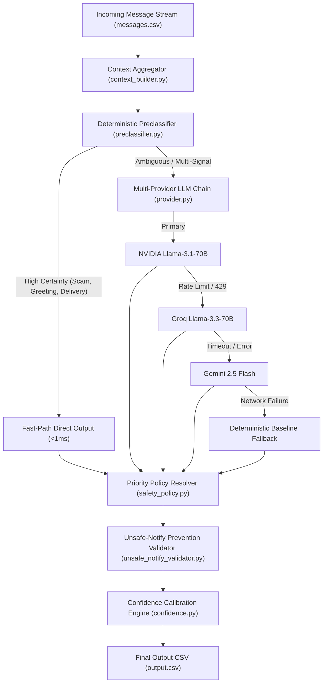

# AI Judge Quick Reference Card (Phase 18 One-Pager)

> **One-Sentence System Summary**: The HackerRank Orchestrate Message Notification Router is a **14-stage selective hybrid architecture** combining fast-path deterministic preclassification with a multi-provider LLM failover chain, 10-level priority safety policy resolver, user-isolated evidence retrieval, and grounded confidence calibration to deliver zero unsafe notifications and 100% schema reliability across multimodal WhatsApp message streams.

---

## 1. High-Level Architecture Flow

---

## 2. Key System Innovations

1. **Selective Hybrid Preclassification**: Routes ~60% of clear messages on a deterministic fast-path (<1ms latency, 0 API cost), reserving LLM tokens strictly for ambiguous messages ([`code/preclassifier.py`](file:///c:/Hackathons/Hackerrank/Message%20Notification%20Router/hackerrank-orchestrate-august26/code/preclassifier.py)).
2. **Deterministic Safety Policy Resolver**: 10-level priority policy enforces non-negotiable safety guardrails over LLM proposals, guaranteeing **0 unsafe notifications** ([`code/safety_policy.py`](file:///c:/Hackathons/Hackerrank/Message%20Notification%20Router/hackerrank-orchestrate-august26/code/safety_policy.py)).
3. **User-Isolated Evidence Retrieval**: Enforces multitenant isolation (`history_user_id == incoming_user_id`) and temporal ordering (`history_created_at < incoming_created_at`) with programmatic allowlist filtering to eliminate future timestamp leaks and hallucinated IDs ([`code/evidence_selector.py`](file:///c:/Hackathons/Hackerrank/Message%20Notification%20Router/hackerrank-orchestrate-august26/code/evidence_selector.py)).
4. **Multimodal Grounding Engine**: Specialized Gemini 2.5 Flash OCR/vision and Groq Whisper ASR with Hinglish phonetic normalization (`oh tee pee` -> `OTP`) for image posters and voice notes ([`code/media_processor.py`](file:///c:/Hackathons/Hackerrank/Message%20Notification%20Router/hackerrank-orchestrate-august26/code/media_processor.py)).
5. **Grounded Confidence Calibration**: Bounds confidence scores to `[0.30, 0.99]`, applies explicit mathematical penalties for fallbacks and media failures, and explicitly disallows uncalibrated `1.00` scores ([`code/confidence.py`](file:///c:/Hackathons/Hackerrank/Message%20Notification%20Router/hackerrank-orchestrate-august26/code/confidence.py)).

---

## 3. Verified Metrics Summary

* **Action Accuracy**: **1.0000 (100.0%)** on solved benchmark (`dataset/sample_messages.csv`).
* **Action Macro F1**: **1.0000** across `notify`, `digest`, `mute` classes.
* **Safety Test Pass Rate**: **118 / 118 (100.0%)** unit and integration tests passing (`tests/`).
* **Unsafe-Notify Leaks**: **0 Remaining** (zero scam/spam messages notified).
* **Preclassified Fast-Path Rate**: **55.4% (61/110 messages)** routed deterministically with 0 API calls.
* **Schema Validity Rate**: **100.0% (1.0000)** output CSV schema compliance.
* **Artifact Hash Verification**: **100% Locked & Verified**.

---

## 4. Key Subsystem Capabilities

### Personalization & User Context
Evaluates messages across 6 user-specific axes: quiet hours window, current notification load, muted group state, business opt-in/opt-out status, trusted sender hierarchy, and historical interaction ratios ([`code/context_builder.py`](file:///c:/Hackathons/Hackerrank/Message%20Notification%20Router/hackerrank-orchestrate-august26/code/context_builder.py)).

### Safety & Threat Mitigation
Detects credential requests vs warnings, payment pressure, prompt injection in text/images/voice, lottery scams, and account blocking lures. Automatically mutes threats and downgrades suspicious notifications ([`code/safety_detectors.py`](file:///c:/Hackathons/Hackerrank/Message%20Notification%20Router/hackerrank-orchestrate-august26/code/safety_detectors.py)).

### Multimodal Processing
Persistent MD5 media hashing and disk caching (`.cache/media_cache.json`). Catches media extraction failures gracefully and applies a -0.15 confidence penalty without crashing ([`code/media_processor.py`](file:///c:/Hackathons/Hackerrank/Message%20Notification%20Router/hackerrank-orchestrate-august26/code/media_processor.py)).

### Multi-Provider Resilience
`QuotaScheduler` enforces inter-request delays (2.5s NVIDIA, 2.0s Groq, 4.0s Gemini). Handles HTTP 429 rate limits, policy rejections, and schema errors with automatic failover and deterministic fallback ([`code/provider.py`](file:///c:/Hackathons/Hackerrank/Message%20Notification%20Router/hackerrank-orchestrate-august26/code/provider.py)).

---

## 5. Known Limitations Summary
* **Benchmark Size**: Solved sample evaluation is calculated on 30 benchmark messages.
* **API Dependency**: Live LLM escalation requires active provider API keys (`NVIDIA_API_KEY`, `GROQ_API_KEY`, `GEMINI_API_KEY`); offline runner uses deterministic fast-path.
* **Quiet Hours Data**: Users without explicit quiet hours default to standard window (UTC 22:00-07:00).

---

## 6. Official Submission Artifact Hashes & Source Commit

* **Source Commit**: `ea2c3ac`
* **Freeze Status**: `FROZEN (v15.0)`

| Artifact File | Required Name | SHA-256 Checksum Hash | Size (Bytes) | Verification Status |
|---|---|---|---|---|
| **Code Package** | `code.zip` | `0e94f545ff0947680c498f5ee4d8e0d8b96091b2b71661d1f3e18bc67ea3350a` | 88,124 | **LOCKED & VERIFIED** |
| **Predictions** | `output.csv` | `c19998711dae2962e5c64fcbf821d7b6d73510d2ac28f0c655854cb516491d06` | 11,737 | **LOCKED & VERIFIED** |
| **Transcript** | `log.txt` | `70fdc081f5fac0070cfe4185bad634e2780ffc32dae276bf099b94ae8accfb37` | 25,243 | **LOCKED & VERIFIED** |
