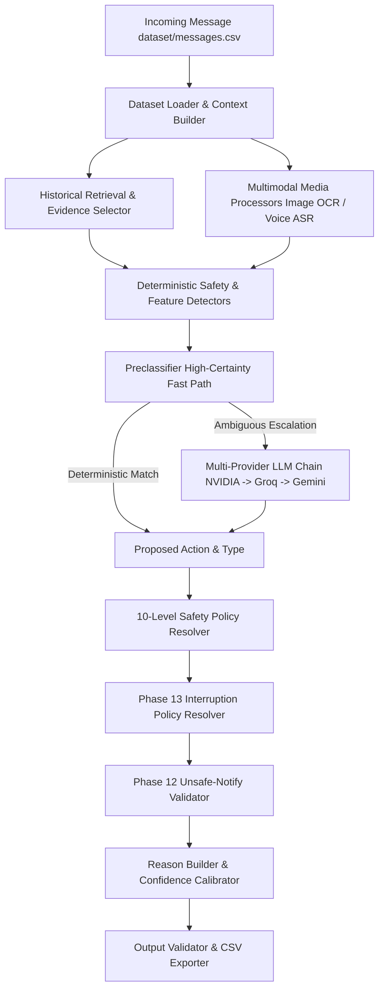

# Phase 18: System Architecture Handoff Specification

## 1. Architectural Overview
The **Message Notification Router** implements a multi-stage hybrid selective pipeline designed to route incoming multimodal WhatsApp messages to one of three actions: `notify`, `digest`, or `mute`. 

The architecture combines fast deterministic preclassification, multimodal feature extraction (OCR & ASR), multi-provider LLM decision proposals (NVIDIA Llama-3.1-70B, Groq Llama-3.3-70B, Gemini 2.5/3.5 Flash), multi-level policy safety overrides, temporal/interruption governance, and strict output contract validation.

---

## 2. Comprehensive Pipeline Component Catalog

### 2.1 Dataset Loader
- **File & Function**: `code/loaders.py` (`load_full_dataset`, `load_csv_records`)
- **Input**: Directory path `dataset/` containing expected CSV files.
- **Output**: Dictionary mapping CSV table names to lists of record dictionaries.
- **Version**: `v15.0`
- **Failure Behavior**: Raises `FileNotFoundError` if essential dataset files are missing; returns empty lists for optional context files.

### 2.2 Context Builder
- **File & Function**: `code/context_builder.py` (`build_incoming_context`)
- **Input**: Raw incoming message record, user profiles, group metadata, business accounts, transaction history.
- **Output**: `IncomingMessageContext` dataclass containing joined user/sender/group/business metadata.
- **Version**: `v14.0`
- **Failure Behavior**: Gracefully populates `missing_context` fields; defaults missing numerical scores to `0.0` or empty strings.

### 2.3 Historical Retrieval
- **File & Function**: `code/retriever.py` (`retrieve_historical_context`)
- **Input**: `user_id`, `created_at`, message text, and full `message_history.csv` / `message_events.csv`.
- **Output**: Filtered list of historical messages preceding `created_at` for the target user.
- **Version**: `v15.0`
- **Failure Behavior**: Returns empty history list if no prior user records exist or if user is unknown.

### 2.4 Evidence Selector
- **File & Function**: `code/evidence_selector.py` (`select_evidence`)
- **Input**: Incoming message, context dictionary, `max_evidence=3`.
- **Output**: List of up to 3 historical `message_id` strings (format `message_0XXX`), or `["none"]`.
- **Version**: `v15.0`
- **Failure Behavior**: Returns `[]` or `["none"]` if no relevant, valid, past-timestamped evidence exists.

### 2.5 Image Processor
- **File & Function**: `code/media_processor.py` (`analyze_image`) & `provider.py` (`analyze_image`)
- **Input**: Image file path from `dataset/media/images/`.
- **Output**: `ImageAnalysis` dataclass (`ocr_text`, `visual_summary`, `has_qr_code`, `has_financial_elements`, `has_promotional_elements`, `is_prompt_injection`).
- **Version**: `p11v1`
- **Failure Behavior**: Uses PIL to verify image header; if file is corrupt or API fails, returns `ImageAnalysis` with `failure=True`, quality `"failed"`, and applies a confidence penalty (-0.15).

### 2.6 Voice Processor
- **File & Function**: `code/media_processor.py` (`process_media`) & `provider.py` (`transcribe_audio`)
- **Input**: Audio file path from `dataset/media/audio/`.
- **Output**: `VoiceAnalysis` dataclass (`transcript`, `contains_otp_request`, `contains_credential_request`, `contains_urgent_language`, `has_financial_elements`, `has_promotional_elements`).
- **Version**: `p11v1`
- **Failure Behavior**: Attempts Groq Whisper ASR -> Gemini Flash fallback -> if both fail, sets `failure=True` and downgrades confidence.

### 2.7 Safety Detectors
- **File & Function**: `code/safety_detectors.py` (`extract_safety_signals`)
- **Input**: `IncomingMessageContext`, raw message, profile, metadata.
- **Output**: `SafetySignals` dataclass (Risk category, risk tier 0-8, source provenance, prompt injection, credential/payment risk flags).
- **Version**: `phase12_v1`
- **Failure Behavior**: Catches inner exceptions and defaults to safe `RiskCategory.NONE` while recording uncertainty.

### 2.8 Urgency & Temporal Analysis
- **File & Function**: `code/temporal.py` (`extract_temporal_context`) & `safety_detectors.py` (`detect_urgency`)
- **Input**: Message text, incoming message timestamp, user timezone.
- **Output**: `TemporalContext` dataclass (Concrete deadline, future event status, time until deadline).
- **Version**: `v13.0`
- **Failure Behavior**: Fallback to current UTC timestamp; marks vague urgency without concrete deadline as low-priority.

### 2.9 Relevance Signal Extractor
- **File & Function**: `code/relevance.py` (`extract_relevance_signals`)
- **Input**: Text, conversation type, group admin status, recent engagement signals.
- **Output**: `RelevanceSignals` dataclass (`direct_message`, `direct_mention`, `active_relationship`, `personal_request`).
- **Version**: `v13.0`
- **Failure Behavior**: Defaults missing relationship data to `False`.

### 2.10 Quiet Hours Evaluator
- **File & Function**: `code/quiet_load.py` (`evaluate_notification_load`) & `router.py`
- **Input**: User `quiet_hours` window (e.g. `22:00-07:00`), message local time.
- **Output**: Boolean `is_quiet_hours`.
- **Version**: `v13.0`
- **Failure Behavior**: Evaluates to `False` if timezone/quiet_hours string is unparseable or empty.

### 2.11 Notification Load Evaluator
- **File & Function**: `code/quiet_load.py` (`evaluate_notification_load`)
- **Input**: `daily_notification_count`, `recent_notification_count`.
- **Output**: Load category string (`low`, `normal`, `high`).
- **Version**: `v13.0`
- **Failure Behavior**: Defaults to `normal` if summary record is missing.

### 2.12 Group Policy Evaluator
- **File & Function**: `code/group_policy.py` (`evaluate_group_policy`)
- **Input**: `group_id`, `muted_groups`, `sender_is_admin`, conversation type.
- **Output**: Group governance flags (`group_muted`, `admin_bypass`).
- **Version**: `v13.0`
- **Failure Behavior**: Muted group defaults to `digest` unless sender is a recognized group admin sending an urgent message.

### 2.13 Preclassifier
- **File & Function**: `code/preclassifier.py` (`preclassify_message`)
- **Input**: Canonical `RouterInput` dataclass.
- **Output**: Tuple `(is_deterministic, RouterProposal, ExecutionMode, reason)`.
- **Version**: `v14.0`
- **Failure Behavior**: If preclassification rules do not trigger high certainty, returns `is_deterministic=False` to escalate message to LLM.

### 2.14 Provider Chain
- **File & Function**: `code/provider.py` (`generate_routing_decision`)
- **Input**: Prompt string and `evidence_allowlist`.
- **Output**: `RouterDecision` proposed action, type, reason, confidence, evidence IDs.
- **Version**: `v14.0`
- **Failure Behavior**: Sequentially attempts NVIDIA (Llama-3.1-70B) -> Groq (Llama-3.3-70B) -> Gemini (2.5/3.5 Flash) -> Baseline Rule Engine.

### 2.15 Safety Policy Resolver
- **File & Function**: `code/safety_policy.py` (`resolve_policy`)
- **Input**: Proposed action/type, `SafetySignals`, deterministic signals, media/evidence quality.
- **Output**: `PolicyDecision` (10-level priority override: Prompt Injection -> Credential Risk -> Payment Risk -> Scam -> Spam -> Promo -> Quiet Hours -> Muted Group -> Default).
- **Version**: `phase12_v1`
- **Failure Behavior**: Hard policy overrides take precedence over LLM proposals; cannot be overridden by model outputs.

### 2.16 Interruption Resolver
- **File & Function**: `code/interruption_resolver.py` (`resolve_interruption`)
- **Input**: Proposed action, `TemporalContext`, `RelevanceSignals`, `SafetySignals`, `NotificationLoad`.
- **Output**: `InterruptionDecision` final action, policy override flag, override reason.
- **Version**: `v13.0`
- **Failure Behavior**: Downgrades non-urgent or quiet-hours messages from `notify` to `digest`.

### 2.17 Unsafe Notify Validator
- **File & Function**: `code/unsafe_notify_validator.py` (`prevent_unsafe_notify`)
- **Input**: Proposed `action="notify"`, safety signals, deterministic context, media failure status.
- **Output**: `UnsafeNotifyResult` (Blocks `notify` if risk tier >= 5, credential request present, or media failed).
- **Version**: `phase12_v1`
- **Failure Behavior**: Forcibly changes action to `mute` or `digest` if safety conditions are violated.

### 2.18 Reason Builder
- **File & Function**: `code/reason_builder.py` (`build_grounded_reason`) & `router.py` (`get_human_readable_reason`)
- **Input**: Rule ID, action, message type, decision signals.
- **Output**: Grounded, concise, human-readable reason string (no internal code syntax).
- **Version**: `v15.0`
- **Failure Behavior**: Falls back to `Routed based on structural patterns and sender history.`

### 2.19 Confidence Calibrator
- **File & Function**: `code/confidence.py` (`calibrate_confidence`)
- **Input**: Raw model confidence, execution mode, deterministic flag, fallback flag, schema repair flag, conflict flag, media failure flag.
- **Output**: `ConfidenceDecision` with `final_confidence` bounded in `[0.30, 0.99]`.
- **Version**: `v15.0`
- **Failure Behavior**: Applies strict penalties (-0.15 fallback, -0.10 schema repair, -0.10 conflict, -0.15 media failure) and clamps value strictly below 1.00.

### 2.20 Output Validator
- **File & Function**: `code/validators.py` (`validate_output_schema`, `validate_predictions`)
- **Input**: Exported `output.csv` path or prediction records list.
- **Output**: Validation status boolean and detailed violation error messages.
- **Version**: `v15.0`
- **Failure Behavior**: Raises `ValueError` if header, column count, actions, message types, evidence IDs, or row counts violate constraints.
