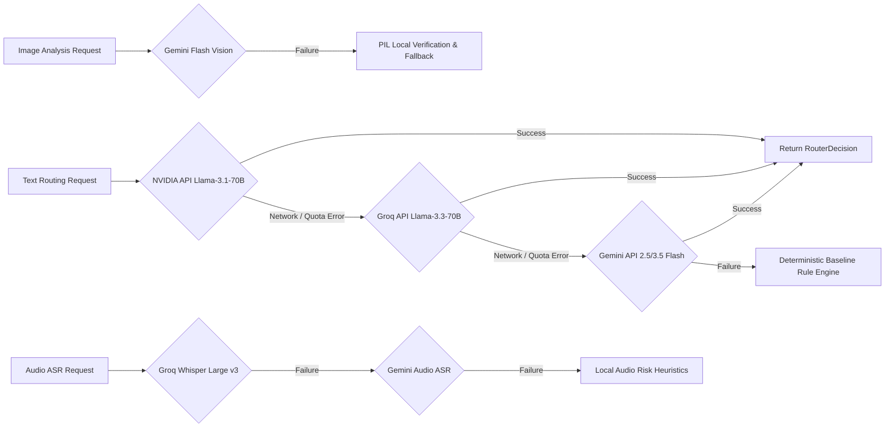

# Phase 18: Multi-Provider Integration & Resilience Handoff

## 1. Provider Ecosystem Architecture
The system integrates a multi-provider LLM and multimodal API architecture in `code/provider.py` to ensure high accuracy, resilient failover, rate-limit safety, and cost efficiency.



---

## 2. Provider Specification Catalog

### 2.1 Primary Text Routing Provider
- **Provider Name**: NVIDIA API Catalog (`integrate.api.nvidia.com`)
- **Model ID**: `meta/llama-3.1-70b-instruct`
- **Role**: Primary LLM decision proposer for ambiguous multi-signal text messages.
- **Invocation Mode**: Chat Completions API with `response_format={"type": "json_object"}`.
- **Temperature**: `0.0` (Deterministic).

### 2.2 Secondary Text Routing Provider
- **Provider Name**: Groq Cloud API (`api.groq.com/openai/v1`)
- **Model ID**: `llama-3.3-70b-versatile`
- **Role**: High-speed, low-latency secondary text failover provider.
- **Invocation Mode**: OpenAI-compatible Chat Completions API with JSON mode.
- **Temperature**: `0.0`.

### 2.3 Image Multimodal Vision Provider
- **Provider Name**: Google Gemini API (`google.genai`)
- **Model ID**: `gemini-3.5-flash` / `gemini-2.5-flash`
- **Role**: OCR text extraction, visual scene summarization, QR code detection, financial element detection, promotional banner flag, and visual prompt injection analysis.
- **Invocation Mode**: `generate_content` with Structured JSON Schema (`response_schema=ImageAnalysisResponse`).

### 2.4 Automatic Speech Recognition (ASR) Provider
- **Provider Name**: Groq Audio API (Primary) & Gemini API (Fallback)
- **Model ID**: `whisper-large-v3-turbo` (Groq) / `gemini-3.5-flash` (Gemini)
- **Role**: Voice note audio transcription and Hinglish-to-English translation.
- **Invocation Mode**: Groq `client.audio.transcriptions.create` / Gemini file upload.

---

## 3. Budgets, Timeouts & Circuit Breakers

| Constraint / Setting | Parameter Value | Source Location | Description |
|---|---|---|---|
| **Max Retries per Provider** | `3 attempts` | `provider.py` | Internal exponential backoff retries per provider |
| **Max Provider Calls per Msg** | `2 calls` | `config.py` | Caps model call escalations per message |
| **Connect Timeout** | `5.0 seconds` | `httpx.Timeout` | Fast connection failure detection |
| **Read Timeout** | `15.0 seconds` | `httpx.Timeout` | Prevents hanging calls during peak provider load |
| **Overall Call Timeout** | `30 seconds` | `config.py` | Hard ceiling for total message processing |

### Rate-Pacing Schedulers (`QuotaScheduler`)
To prevent HTTP 429 rate limit exceptions, request rate pacing is actively enforced before calling external endpoints:
- **NVIDIA Pacing**: Minimum 2.5 seconds between requests (~24 RPM max).
- **Groq Pacing**: Minimum 2.0 seconds between requests (~30 RPM max).
- **Gemini Pacing**: Minimum 4.0 seconds between requests (~15 RPM max).

---

## 4. Media Caching Strategy
- **Cache Storage File**: `.cache/media_cache.json`
- **Cache Key Construction**: `f"{media_id}_{file_hash}_{prompt_version}_{media_type}"` where `file_hash` is the MD5 hash of raw media file content.
- **Cache Contents**: Stores full `ImageAnalysis` or `VoiceAnalysis` dictionary (`extracted_text`, `summary`, `risk_signals`, `quality`, `is_prompt_injection`).
- **Resiliency Impact**: Re-running the pipeline loads media analysis in ~0.001s per item, preserving API quotas and enabling instant resumption.

---

## 5. Policy Rejection Handling & Fallback Chain

### Policy Rejection Exception (`PolicyRejectionError`)
If a provider API rejects a prompt due to safety filtering (e.g. prompt injection, explicit text, or safety blocklist):
1. The error is classified as `PROVIDER_POLICY_REJECTION`.
2. The pipeline DOES NOT re-prompt or attempt redundant LLM calls.
3. Execution routes immediately to `policy_rejection_fallback`, assigning `action="mute"` or `"digest"` and recording the policy override trace.

### Full Fallback Execution Chain
```text
NVIDIA (Llama-3.1-70B)
  └─► [API Error / Quota Exhaustion]
        └─► Groq (Llama-3.3-70B)
              └─► [API Error / Rate Limit]
                    └─► Gemini (2.5/3.5 Flash)
                          └─► [API Error / Missing Keys]
                                └─► Local Deterministic Preclassifier & Baseline Rule Engine
```

---

## 6. Known Provider Limitations & Edge Cases
1. **Free Tier Quotas**: Free API keys have tight RPM limits. System relies on `QuotaScheduler` to pace execution cleanly.
2. **Third-Party API Outages**: Internet connectivity loss triggers deterministic rule engine without throwing uncaught exceptions.
3. **Model Safety False Positives**: LLM provider safety filters may occasionally block safety test strings. Handled cleanly via `PolicyRejectionError`.
